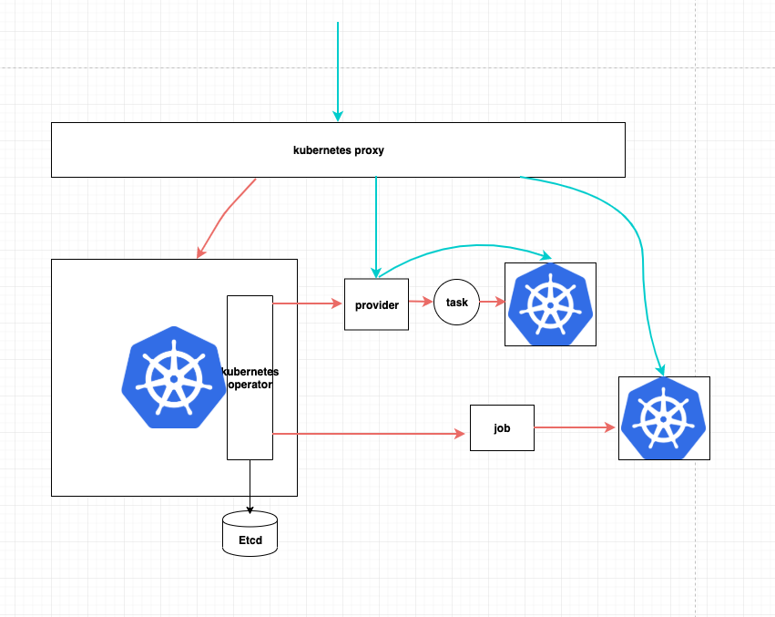

## kubernetes-operator 

kubernetes-operator is a control plane and manage all kubernetes cluster lifecycle(Kubernetes on Kubernetes).

</img>

## Introduce

kubernetes-operator contains several large parts：

- ECS (elastic cloud service): is a kubernetes operator deploy in meta kubernetes and manage all kubernetes clusters(create、scale、delete).
- ansible: Deploy kubernetes in binary mode use ansible.
- kubernetes proxy : manage the lifecycle of all kubernetes cluster applications, eg: metric-server、 promethus、log-polit...

## Development Plan

1. use binary deploy k8s cluster
2. kubernetes-operator(ecs) develop,support kubernetes workload cluster create and delete
3. kubernetes-operator crd ValidatingAdmissionWebhook develop
4. use ansible deploy HA master
5. kubernetes proxy develop 
6. ecs support kubernetes workload cluster scale
7. deployed kubernetes cluster has metric-server、 promethus、log-polit、es...
